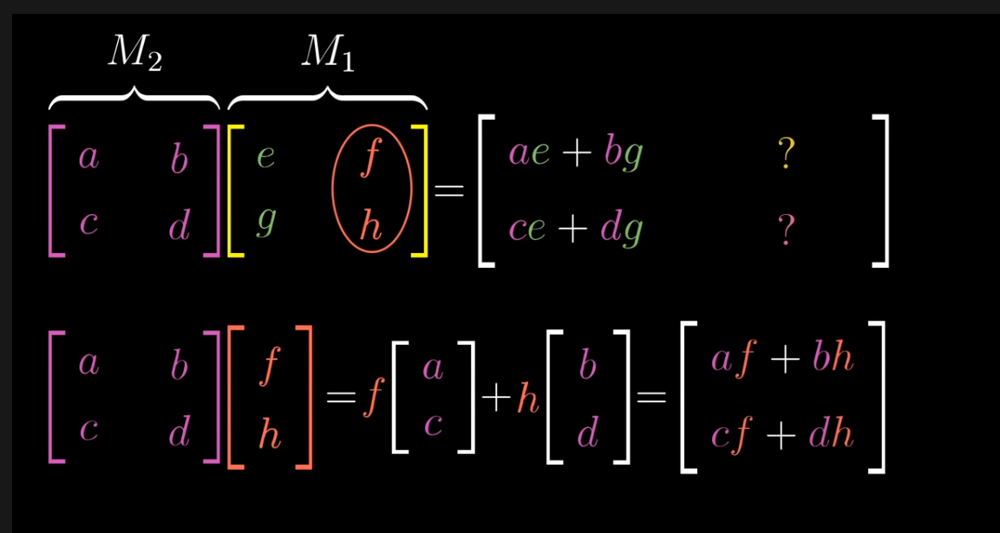

# essence of linear algebra
## https://www.3blue1brown.com/topics/linear-algebra
“The introduction of numbers as coordinates is an act of violence.”
— Hermann Weyl 

"Mathematics requires a small dose, not of genius, but of an imaginative freedom which, inlasrger dose, would be insanity"
-- Angus K. Rodgers

## What is a vector
### Physics Student:
- Arrows pointing in space
- Defined as lenght and angle
- don't care about it's position
- can have 2d or 3d vectors

### CS Student
- vectors are ordered lists of numbers
- list of 2 is 2 dimensional

### Mathmatician
- generalize views

## Vector in linear algebra
- almost always starts at root/origin/0,0
- a set of instructions how to get from tail(origin) to the tip
- written vertially with [] around

## Scaling
sizing a vector by multiplier
## Scalar
the multiplier e.g. 2/3  2 -1.8

## Basis Vectors
## Linear Combinations
- combination of 2 vectorsje
## Span
## Bases i^ j^ ( i hat, j hat) 
## linearly dependant -> will end in nullspace
## linearly independant -> will give unique/reversable result
## transformation(function) inputvector -> outputvector
## linear transformation -> using a matrix to transform item(s) such that the relative distance stays the same
## shear
## composition
- not commutative ( except 3d rotation ?? ) 
- not associative
- is processed like function (right to left)

        

## challenges REST
- well you could ask to supply the eigenvectors given a certain transformation.

|a b|x|
|c d|y| =  x[a c] + y[b d]

